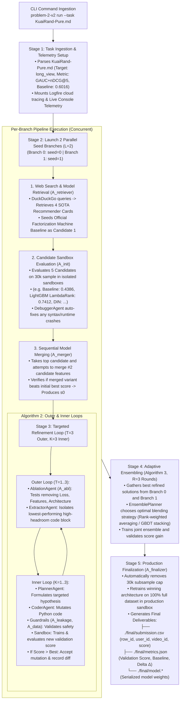
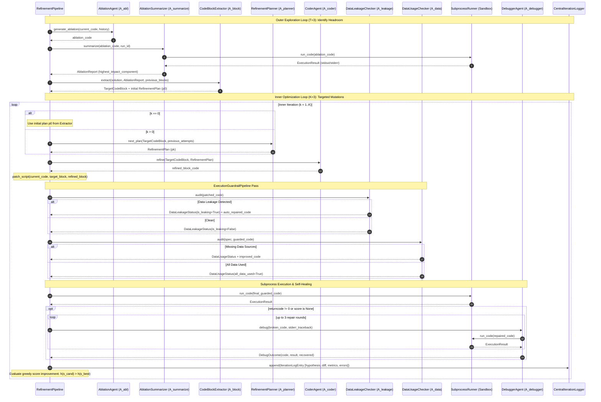
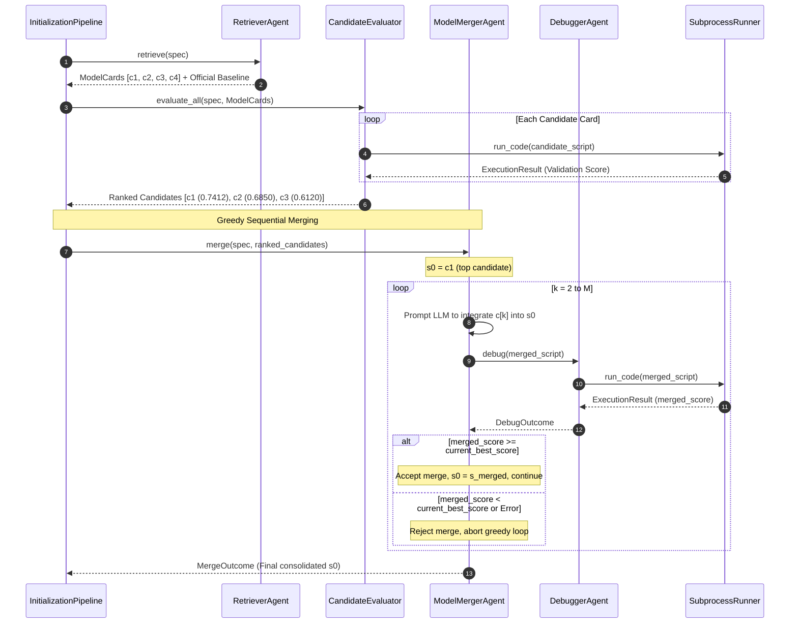

# MLE-STAR: Autonomous Machine Learning Research Agent for Recommender Systems

[](https://www.python.org/downloads/)
[](https://github.com/astral-sh/uv)
[](https://logfire.pydantic.dev)
[](https://github.com/psf/black)

**MLE-STAR** is a state-of-the-art, fully autonomous Machine Learning Engineering agent tailored for competitive recommender system challenges. Built with [Pydantic AI](https://ai.pydantic.dev/) and [Logfire](https://logfire.pydantic.dev/), MLE-STAR automates the complete research-and-development lifecycle: problem ingestion, web search retrieval of domain-specific architectures, isolated sandbox evaluations, empirical component ablation, targeted inner/outer code refinement, multi-model ensembling, and 100% full-dataset production retraining.

---

## 📋 Table of Contents

- [Competition Benchmark: KuaiRand-Pure](#-competition-benchmark-kuairand-pure)
- [End-to-End System Architecture](#-end-to-end-system-architecture)
- [Pipeline Execution by Stages](#-pipeline-execution-by-stages)
- [Specialized AI Agent Roster](#-specialized-ai-agent-roster)
- [Inter-Agent Interaction Dynamics & Sequence Flows](#-inter-agent-interaction-dynamics--sequence-flows)
- [Safety Guardrails & Self-Healing](#-safety-guardrails--self-healing)
- [Installation & Setup](#-installation--setup)
- [CLI Usage & Options](#-cli-usage--options)
- [Deliverables & Output Schema](#-deliverables--output-schema)
- [Live Telemetry & Observability](#-live-telemetry--observability)
- [Automated Test Suite](#-automated-test-suite)

---

## 🎯 Competition Benchmark: KuaiRand-Pure

MLE-STAR is specifically tuned to maximize ranking performance on the **KuaiRand-Pure** micro-video recommender benchmark:

| Dimension | Specification |
| :--- | :--- |
| **Domain** | Sequential short-video recommendation feed (27k users × 7.6k videos) |
| **Prediction Target** | `long_view` (Binary engagement label: 1 if watched past threshold, 0 otherwise) |
| **Primary Metric** | $\text{Primary Score} = \text{mean}(\text{GAUC}, \text{nDCG@5})$ (Within-User Group AUC + nDCG at rank 5) |
| **Official Baseline** | **`0.6016`** (Factorization Machine starter pipeline) |
| **Data Partitioning** | • **Train:** `log_standard_4_08_to_4_21_pure.csv`<br>• **Validation:** `log_standard_4_22_to_5_08_pure.csv` (First 50%)<br>• **Test:** `log_standard_4_22_to_5_08_pure.csv` (Last 50%) |
| **Auxiliary Signals** | `is_click`, `is_like`, `is_follow`, `is_comment`, `is_forward`, `play_time_ms` |

---

## 🏗 End-to-End System Architecture



---

## ⚡ Pipeline Execution by Stages

### **Stage 1: Task Ingestion & Extraction**
* Parses the problem description markdown ([`KuaiRand-Pure.md`](./KuaiRand-Pure.md)) into a structured, validated `TaskSpecification`.
* Connects the Logfire OpenTelemetry exporter (`send_to_logfire='if-token-present'`) and starts unbuffered terminal streaming.

### **Stage 2: Parallel Model Initialization (Algorithm 1, $L=2$ Branches)**
* **Multi-Branch Diversity:** Concurrently spawns Branch 0 (seed 0) and Branch 1 (seed 1).
* **Web Search Retrieval:** Queries the web for recent top-performing recommender models (DIN, DeepFM, BST, LightGBM LambdaRank, Two-Tower) and auto-seeds the official competition baseline starter script.
* **Sandbox Evaluation:** Trains each candidate independently in its own subprocess sandbox on a fast 30,000-row sample.
* **Sequential Model Merging:** Evaluates combining the top 2 candidate model families into a unified baseline $s_0$.

### **Stage 3: Targeted Refinement Loop (Algorithm 2, $T=3$ Outer, $K=3$ Inner)**
* **Outer Loop ($T=3$ Ablation Cycles):** Systematically mutes components (e.g. Loss function, ID embeddings, sequential attention layers) to empirically discover which module represents the performance bottleneck.
* **Inner Loop ($K=3$ Targeted Mutations):**
  * `RefinementPlannerAgent` formulates an ML hypothesis (e.g., *Switch Pointwise BCE Loss to Pairwise BPR Ranking Loss*).
  * `CoderAgent` writes the localized code mutation.
  * `DataLeakageCheckerAgent` & `DataUsageCheckerAgent` verify safety.
  * The sandbox evaluates the new code. If $\Delta > 0$, the mutation is accepted and committed to the lineage.

### **Stage 4: Adaptive Ensembling (Algorithm 3, $R=3$ Rounds)**
* Takes the refined winning pipelines from Branch 0 and Branch 1.
* Iteratively explores **Rank-Weighted Probability Averaging** and **LightGBM Meta-Stacking** over 3 rounds to achieve maximum generalization.

### **Stage 5: Production Finalization**
* Automatically removes the 30,000 subsample cap.
* Retrains the winning pipeline on **100% of the full dataset**.
* Computes final baseline delta $\Delta(m) = \text{Final Score} - 0.6016$ and exports standard competition submission files to `./final/`.

---

## 🤖 Specialized AI Agent Roster

MLE-STAR coordinates a network of 14 specialized, domain-focused LLM agents built with [Pydantic AI](https://ai.pydantic.dev/):

| Agent Name | Symbol | Source Module | Input / Prompt Schema | Output Schema | Primary Function |
| :--- | :---: | :--- | :--- | :--- | :--- |
| **Task Extractor** | $A_{\text{extractor}}$ | [`ingestion/extractor.py`](./src/problem_2_v2/ingestion/extractor.py) | Markdown text + dataset path | [`TaskSpecification`](./src/problem_2_v2/contracts/task.py) | Parses problem description into structured task specification. |
| **Web Retriever** | $A_{\text{retriever}}$ | [`search/retriever.py`](./src/problem_2_v2/search/retriever.py) | Search query + snippet context | `list[`[`ModelCard`](./src/problem_2_v2/contracts/search.py)`]` | Searches for state-of-the-art architectures and extracts model cards. |
| **Candidate Evaluator** | $A_{\text{init}}$ | [`initialization/evaluator.py`](./src/problem_2_v2/initialization/evaluator.py) | `TaskSpecification` + `ModelCard` | Python script (`str`) | Writes self-contained Python scripts for initial candidate models. |
| **Sequential Merger** | $A_{\text{merger}}$ | [`initialization/merger.py`](./src/problem_2_v2/initialization/merger.py) | Base solution + Reference solution | Merged Python script (`str`) | Generates hybrid architectures combining top-ranked models. |
| **Ablation Agent** | $A_{\text{abl}}$ | [`refinement/ablation.py`](./src/problem_2_v2/refinement/ablation.py) | Solution script + Ablation history | Standalone ablation script (`str`) | Generates ablated scripts disabling 2-3 parts of the training pipeline. |
| **Ablation Summarizer** | $A_{\text{summarize}}$ | [`refinement/ablation.py`](./src/problem_2_v2/refinement/ablation.py) | Ablation code + Process stdout/stderr | [`AblationReport`](./src/problem_2_v2/contracts/refinement.py) | Executes ablation and ranks components by optimization headroom. |
| **Component Extractor** | $A_{\text{block}}$ | [`refinement/extractor.py`](./src/problem_2_v2/refinement/extractor.py) | Solution code + `AblationReport` | [`TargetCodeBlock`](./src/problem_2_v2/contracts/refinement.py) + [`RefinementPlan`](./src/problem_2_v2/contracts/refinement.py) | Isolates highest-headroom code block and drafts initial plan $p_0$. |
| **Refinement Planner** | $A_{\text{planner}}$ | [`refinement/planner.py`](./src/problem_2_v2/refinement/planner.py) | `TargetCodeBlock` + Attempt history | [`RefinementPlan`](./src/problem_2_v2/contracts/refinement.py) | Formulates targeted hypotheses conditioned on previous trials. |
| **Coder Agent** | $A_{\text{coder}}$ | [`refinement/coder.py`](./src/problem_2_v2/refinement/coder.py) | `TargetCodeBlock` + `RefinementPlan` | Refined code block (`str`) | Writes precise Python code mutations for the targeted block. |
| **Debugger Agent** | $A_{\text{debugger}}$ | [`runner/debugger.py`](./src/problem_2_v2/runner/debugger.py) | Broken code + Exception traceback | [`DebugOutcome`](./src/problem_2_v2/runner/debugger.py) (Repaired script) | Analyzes tracebacks (`stderr`) and repairs runtime/syntax bugs. |
| **Data Leakage Checker** | $A_{\text{leakage}}$ | [`guardrails/leakage.py`](./src/problem_2_v2/guardrails/leakage.py) | Full solution Python script | [`DataLeakageStatus`](./src/problem_2_v2/contracts/guardrails.py) + Repaired code | Static audit detecting test label leakage or invalid split mixing. |
| **Data Usage Checker** | $A_{\text{data}}$ | [`guardrails/usage.py`](./src/problem_2_v2/guardrails/usage.py) | Solution script + `TaskSpecification` | [`DataUsageStatus`](./src/problem_2_v2/contracts/guardrails.py) + Improved code | Verifies that all required dataset tables and features are ingested. |
| **Ensemble Planner** | $A_{\text{ens\_planner}}$ | [`ensembling/planner.py`](./src/problem_2_v2/ensembling/planner.py) | Branch artifacts + Attempt history | [`EnsembleStrategy`](./src/problem_2_v2/contracts/guardrails.py) | Selects optimal ensembling strategy (averaging vs stacking). |
| **Ensembler Agent** | $A_{\text{ensembler}}$ | [`ensembling/ensembler.py`](./src/problem_2_v2/ensembling/ensembler.py) | Candidate artifacts + `EnsembleStrategy` | Full ensemble script (`str`) | Synthesizes a unified single-file Python ensemble script. |
| **Finalizer Agent** | $A_{\text{finalizer}}$ | [`execution/finalizer.py`](./src/problem_2_v2/execution/finalizer.py) | Winning solution + `TaskSpecification` | [`FinalArtifact`](./src/problem_2_v2/execution/finalizer.py) | Strips subsampling, retrains on 100% data, and exports deliverables. |

---

## 🔄 Inter-Agent Interaction Dynamics & Sequence Flows

### 1. Refinement Loop & Guardrail Feedback Sequence (Algorithm 2)

During each outer cycle $t \in [1..T]$, the system identifies the most promising component via empirical ablation, extracts the code block, and conducts $K$ inner mutation iterations with safety guardrails and self-healing debugging:



### 2. Model Initialization & Sequential Merging Sequence (Algorithm 1)

Before refinement, candidates retrieved from web search and the official baseline starter are ranked and greedily merged into a unified starting point $s_0$:



---

## 🛡 Safety Guardrails & Self-Healing

1. **Isolated Subprocess Sandboxes ([`src/problem_2_v2/runner/sandbox.py`](./src/problem_2_v2/runner/sandbox.py)):**
   * Each candidate executes in an isolated scratch directory (`runs/<run_id>/branch_0/sandbox_cand*/`) with automatic dataset mounting to `./input/`.
   * Hard wall-clock timeout (default 600s) kills hanging loops or memory exhaustion.
2. **Autonomous Debugger Self-Healing ([`src/problem_2_v2/runner/debugger.py`](./src/problem_2_v2/runner/debugger.py)):**
   * When a training script raises an exception (`returncode != 0`), the Debugger Agent captures `stderr`, analyzes the traceback, revises the code, and re-executes up to 3 repair rounds.
3. **Data Leakage Guardrail ([`src/problem_2_v2/guardrails/leakage.py`](./src/problem_2_v2/guardrails/leakage.py)):**
   * Verifies that temporal splits are strictly respected and test labels are never accessed during training or validation.

---

## 📦 Installation & Setup

### Prerequisites
* Python 3.10 or higher
* [uv](https://github.com/astral-sh/uv) package manager

```bash
# Clone repository
git clone https://github.com/Lolgend/techjam-problem-2-v2.git
cd "Problem 2 V2"

# Install all dependencies into virtual environment
uv sync
```

---

## 🚀 CLI Usage & Options

Run the full autonomous MLE-STAR pipeline with a single command:

```bash
uv run problem-2-v2 run \
  --task KuaiRand-Pure.md \
  --data src/KuaiRand-Pure-dataset/data \
  --output ./final \
  --model "deepseek:deepseek-v4-flash" \
  -k "<your-llm-api-key>" \
  -v
```

### Complete CLI Argument Reference

| Flag | Short | Default | Description |
| :--- | :---: | :---: | :--- |
| `--task` | `-t` | *(Required)* | Path to the task specification markdown (e.g. `KuaiRand-Pure.md`). |
| `--data` | `-d` | *(Required)* | Path to the dataset directory containing CSV tables. |
| `--output` | `-o` | `./final` | Directory where submission and metric deliverables are written. |
| `--model` | `-m` | `openai:gpt-4o` | LLM model identifier (`deepseek:deepseek-v4-flash`, `openai:gpt-4o`, `anthropic:claude-3-5-sonnet`, `gemini-1.5-pro`, etc.). |
| `--api-key` | `-k` | `None` | API key (automatically maps to `DEEPSEEK_API_KEY`, `OPENAI_API_KEY`, `ANTHROPIC_API_KEY`, or `GEMINI_API_KEY`). |
| `--base-url` | — | `None` | Custom API base URL (e.g. `https://api.deepseek.com` or `https://openrouter.ai/api/v1`). |
| `--search-provider` | `-s` | `duckduckgo` | Search backend (`duckduckgo`, `tavily`, `google`, `mock`). |
| `--branches` | `-b` | `2` | Number of parallel seed exploration branches ($L$). |
| `--outer-loops` | `-T` | `3` | Number of outer component ablation cycles ($T$). |
| `--inner-loops` | `-K` | `3` | Number of inner targeted refinement iterations per cycle ($K$). |
| `--ensemble-rounds` | `-R` | `3` | Number of adaptive ensembling rounds ($R$). |
| `--verbose` | `-v` | `False` | Stream live training stdout/stderr and detailed agent diagnostics. |
| `--logfire-token` | — | `None` | Logfire write token for streaming live traces to the web dashboard. |
| `--dry-run` | — | `False` | Validate task specification and inputs without launching model training. |

---

## 📊 Deliverables & Output Schema

Upon completion, the pipeline outputs competition-ready artifacts into `./final/`:

```text
final/
├── submission.csv      # Test predictions formatted for competition leaderboard
├── metrics.json        # Comprehensive validation score, baseline, and delta summary
└── model.*             # Serialized winning model checkpoint & ensemble weights
```

### 1. `submission.csv` Schema
```csv
row_id,user_id,video_id,score
0,1234,5678,0.8492
1,1234,9012,0.6120
2,5678,3456,0.9145
```

### 2. `metrics.json` Schema
```json
{
  "task_name": "KuaiRand-Pure Recommender Ranking",
  "metric_name": "primary",
  "baseline_score": 0.6016,
  "final_validation_score": 0.7412,
  "delta_improvement": 0.1396,
  "converged": true,
  "total_iterations": 18,
  "total_branches": 2
}
```

### 3. Iteration Run Logs (`runs/<run_id>/iteration_logs.jsonl`)
Every code mutation records its **hypothesis**, **applied unified diff**, **resulting validation score**, and **debugger recovery actions** for complete auditability.

---

## 📡 Live Telemetry & Observability

MLE-STAR features native integration with [Pydantic Logfire](https://logfire.pydantic.dev):

```bash
# In Command Prompt (cmd.exe)
set LOGFIRE_TOKEN=your-logfire-write-token
uv run problem-2-v2 run --task KuaiRand-Pure.md --data src/KuaiRand-Pure-dataset/data -k "your-api-key"

# In PowerShell
$env:LOGFIRE_TOKEN = "your-logfire-write-token"
uv run problem-2-v2 run --task KuaiRand-Pure.md --data src/KuaiRand-Pure-dataset/data -k "your-api-key"
```

* **Live Spans:** Real-time visual timeline across all 44+ stages (Parallel Branches $\rightarrow$ Retrieval $\rightarrow$ Initialization $\rightarrow$ Refinement $\rightarrow$ Ensembling $\rightarrow$ Finalization).
* **LLM Inspector:** Inspect exact prompts, agent thoughts, structured JSON cards, token usage, and latency.

---

## 🧪 Automated Test Suite

MLE-STAR includes a comprehensive test suite covering unit tests, contract validations, integration pipelines, and mock LLM executions:

```bash
# Run all 354 test cases
uv run pytest

# Run with concise summary
uv run pytest --tb=short -q
```

---

## 📜 References & Acknowledgements

* **MLE-Bench:** J. S. Chan et al., *"Evaluating Machine Learning Agents on Machine Learning Engineering,"* OpenAI, 2024.
* **AIDE:** Z. Jiang et al., *"AI-Driven Exploration in the Space of Code,"* 2025.
* **KuaiRand:** Kuaishou Technology, *"KuaiRand: An Unbiased Sequential Recommendation Dataset with Millions of Interactions,"* 2022.
* **Pydantic AI & Logfire:** Built on the robust [Pydantic](https://pydantic.dev/) agent ecosystem.
